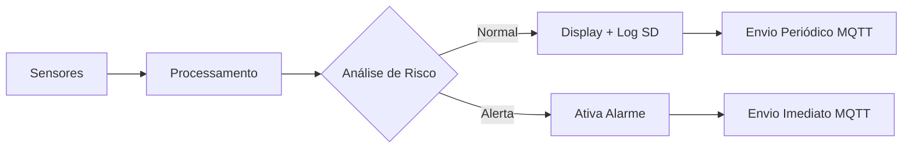

# 🚨 Sistema de Monitoramento Ambiental com Detecção de GLP

<div align="center">


**Sistema embarcado completo para monitoramento ambiental com foco em segurança predial**

[](#-features)
[](#-hardware)
[](#-instalação)
[](#-testes)

</div>

## 📖 Sobre o Projeto

Sistema desenvolvido para a **Residência de Sistemas Embarcados** que realiza monitoramento contínuo de condições ambientais com ênfase na detecção de **Gás Liquefeito de Petróleo (GLP)**. O projeto integra múltiplos sensores, comunicação wireless, armazenamento local e sistema de alertas para aplicações de **IoT Industrial**.

### 🎯 Objetivos
- Monitorar parâmetros ambientais em tempo real
- Detectar vazamentos de GLP com alta sensibilidade
- Alertar visual e sonora sobre condições perigosas
- Armazenar dados localmente para análise posterior
- Transmitir dados remotamente para dashboard cloud
- Prover interface física intuitiva para operadores

## 🚀 Features

### ✅ **Funcionalidades Implementadas**
- **Monitoramento Multi-sensor**: Temperatura, umidade, pressão, altitude e concentração de GLP
- **Sistema de Alarme Inteligente**: 3 níveis de alerta com sirene de frequência variável
- **Comunicação Bidirecional**: WiFi + MQTT com ThingsBoard Cloud
- **Armazenamento Robusto**: Logs diários em cartão SD (formato CSV)
- **Interface Completa**: Display OLED + LEDs + Botões físicos
- **Multitarefa Real**: FreeRTOS para operação concorrente
- **Resiliência**: Sistema tolerante a falhas com auto-recuperação

### 🔄 **Fluxo de Operação**


## 🔧 Hardware

### 🧩 Componentes Principais
| Componente | Modelo | Função |
|------------|--------|--------|
| Microcontrolador | Raspberry Pi Pico | Processamento principal |
| Sensor T/H | AHT10 | Temperatura e Umidade |
| Sensor Pressão | BMP280 | Pressão Atmosférica e Altitude |
| Sensor Gás | MQ-6 | Detecção de GLP |
| Display | SSD1306 128x64 | Interface visual |
| Cartão SD | MicroSD + Adapter | Armazenamento de logs |
| Indicadores | LEDs (Verde/Vermelho) | Status do sistema |
| Alertas | Buzzers (2x) | Sirene de alarme |
| Interface | Botões (2x) | Controle manual |

### 📍 Pinagem
| Pino | Componente | Função |
|------|------------|--------|
| GPIO0-1 | AHT10 | I2C0 (SDA/SCL) |
| GPIO14-15 | OLED | I2C1 (SDA/SCL) |
| GPIO28 | MQ-6 | Entrada Analógica (ADC2) |
| GPIO11 | LED Verde | Sistema Normal |
| GPIO13 | LED Vermelho | Alerta |
| GPIO5 | Botão | Silenciar Alarme |
| GPIO6 | Botão | Alarme Manual |
| GPIO21,10 | Buzzers | Sirene (2 canais) |
| SPI0 | SD Card | Comunicação SPI |

## ⚡ Instalação

### 📋 Pré-requisitos

#### Hardware
- Raspberry Pi Pico
- Sensores listados acima
- Cartão MicroSD formatado (FAT32)
- Conexão WiFi disponível

#### Software
- [Raspberry Pi Pico SDK](https://github.com/raspberrypi/pico-sdk)
- [CMake](https://cmake.org/) (≥ 3.13)
- [GNU Arm Embedded Toolchain](https://developer.arm.com/tools-and-software/open-source-software/developer-tools/gnu-toolchain/gnu-rm)
- [Visual Studio Code](https://code.visualstudio.com/) (recomendado) ou sua IDE preferida

### 🔧 Configuração do Projeto

1. **Clone o repositório**
```bash
git clone https://github.com/seu-usuario/monitoramento-glp-pico.git
cd monitoramento-glp-pico
```

2. **Configure as variáveis de ambiente**
```bash
# No arquivo main.c, ajuste:
#define SSID "Sua_Rede_WiFi"
#define PASS "Sua_Senha_WiFi"
#define THINGSBOARD_ACCESS_TOKEN "Seu_Token_ThingsBoard"
```

3. **Configure o ambiente de desenvolvimento**
```bash
# Instale o Pico SDK
git clone https://github.com/raspberrypi/pico-sdk.git
cd pico-sdk
git submodule update --init

# Configure variáveis de ambiente
export PICO_SDK_PATH=/caminho/para/pico-sdk
```

4. **Compile o projeto**
```bash
mkdir build
cd build
cmake ..
make
```

5. **Instale no Raspberry Pi Pico**
- Pressione o botão BOOTSEL enquanto conecta o USB
- Copie o arquivo `.uf2` gerado para a unidade RPI-RP2

## 📁 Estrutura do Projeto

```
monitoramento-glp-pico/
├── src/
│   ├── main.c                 # Código principal
│   ├── sensors/               # Drivers dos sensores
│   ├── display/               # Controlador OLED
│   ├── storage/               # Sistema de arquivos SD
│   └── communication/         # WiFi e MQTT
├── include/
│   ├── config.h               # Configurações do sistema
│   └── shared.h               # Variáveis compartilhadas
├── tests/                     # Scripts de teste
├── docs/                      # Documentação
├── CMakeLists.txt
└── README.md
```

## ⚙️ Configuração

### 🔧 Parâmetros do Sistema

| Parâmetro | Valor Padrão | Descrição |
|-----------|--------------|-----------|
| Limite Alerta | 300 ppm | LED vermelho acende |
| Limite Perigo | 600 ppm | Sirene moderada |
| Limite Crítico | 1000 ppm | Sirene dupla acelerada |
| Intervalo Leitura | 1000 ms | Leitura dos sensores |
| Intervalo SD | 60000 ms | Gravação no cartão |
| Intervalo MQTT | 60000 ms | Envio para cloud |
| Timeout Silêncio | 300000 ms | 5 minutos |

### 🌐 Configuração WiFi e MQTT

Edite o arquivo `config.h`:

```c
// Configurações de Rede
#define SSID "Nome_Da_Sua_Rede"
#define PASS "Senha_Da_Sua_Rede"

// ThingsBoard Cloud
#define THINGSBOARD_HOST "thingsboard.cloud"
#define THINGSBOARD_PORT 1883
#define THINGSBOARD_ACCESS_TOKEN "seu_token_aqui"
```

## 🎮 Como Usar

### 🚀 Inicialização
1. Conecte todos os sensores conforme diagrama de pinagem
2. Insira cartão SD formatado
3. Alimente o sistema via USB ou fonte 5V
4. Aguarde a sequência de inicialização:
   - LED verde acende
   - Display mostra mensagem inicial
   - Buzzers tocam sequência de confirmação
   - LED verde pisca ao conectar no WiFi

### 🎛️ Controles Manuais

#### Botão de Silenciar (GPIO5)
- **Pressione uma vez**: Silencia sirene (LED verde pisca)
- **Pressione novamente**: Reativa alarme
- **Timeout automático**: Após 5 minutos, sirene reativa automaticamente

#### Botão Manual (GPIO6)
- **Pressione uma vez**: Ativa alarme manual (para testes)
- **Pressione novamente**: Desativa alarme manual

### 📊 Interpretando os Indicadores

#### LEDs
| Estado | LED Verde | LED Vermelho | Significado |
|--------|-----------|--------------|-------------|
| Normal | ACESO | APAGADO | Sistema operando normalmente |
| Alerta | APAGADO | PISCA (500ms) | GLP > 300 ppm |
| Perigo | APAGADO | PISCA (250ms) | GLP > 600 ppm |
| Crítico | APAGADO | PISCA (100ms) | GLP > 1000 ppm |
| Silenciado | PISCA (1000ms) | APAGADO | Alarme silenciado temporariamente |

#### Display OLED
```
Linha 1: T:25.5C H:65.2%     # AHT10
Linha 2: P:1013hPa A:50m      # BMP280
Linha 3: GLP:15.2ppm TB:OK    # Status atual
Linha 4: S:20260208 E:20260208 # Arquivos de log
```

### 💾 Sistema de Logging

O sistema cria automaticamente dois arquivos por dia no cartão SD:

#### `SENSORES_YYYYMMDD.csv`
```csv
Data_Hora,Temp_AHT(C),Hum_AHT(%),Temp_BMP(C),Press_BMP(hPa),Alt_BMP(m),GLP(ppm)
2026-02-08 12:30:00,25.50,65.20,25.30,1013.25,50.00,15.20
```

#### `EVENTOS_YYYYMMDD.csv`
```csv
Data_Hora,Evento,Detalhes,GLP_Atual(ppm),Alarme_Ativo,Manual,Silenciado,MQTT_Enviado
2026-02-08 12:31:15,ALERTA_GAS,Gas detectado: 150.20 ppm,150.20,SIM,NAO,NAO,SIM
```

### ☁️ Integração com ThingsBoard

1. **Crie uma conta** em [thingsboard.cloud](https://thingsboard.cloud)
2. **Crie um novo dispositivo** e copie o token de acesso
3. **Configure o token** no código fonte
4. **Acesse o dashboard** para visualizar dados em tempo real

**Dados enviados**:
- Temperatura (AHT10)
- Umidade (AHT10)
- Pressão atmosférica (BMP280)
- Altitude (BMP280)
- Concentração de GLP (MQ-6)
- Status do alarme

## 🧪 Testes

### ✅ Testes Realizados
- [x] Inicialização do sistema completo
- [x] Calibração automática do MQ-6
- [x] Sistema de alarme com 3 níveis
- [x] Comunicação WiFi e MQTT
- [x] Armazenamento em SD card
- [x] Interface com usuário (display + botões)
- [x] Operação contínua por 24h
- [x] Recuperação de falhas

### 🔬 Testes de Calibração do MQ-6
```bash
1. Inicie o sistema em ambiente com ar limpo
2. Aguarde a mensagem: "[MQ-6] R0 calibrado: XX.XX kΩ"
3. O sistema está pronto para detecção precisa
```

## 🔧 Troubleshooting

### ❗ Problemas Comuns

#### WiFi não conecta
```bash
1. Verifique SSID/senha no código
2. Confira força do sinal WiFi
3. Verifique logs de inicialização
4. Teste com rede 2.4GHz (5GHz pode não ser compatível)
```

#### Sensor não detectado
```bash
1. Verifique conexões I2C
2. Teste com exemplo mínimo do sensor
3. Verifique endereços I2C no código
4. Confira alimentação (3.3V)
```

#### Cartão SD não é detectado
```bash
1. Formate como FAT32
2. Verifique conexões SPI
3. Teste com cartão de capacidade ≤32GB
4. Verifique pino CS (GPIO17)
```

#### Alarme não ativa
```bash
1. Teste botão manual
2. Verifique leitura do MQ-6 no serial
3. Confira configuração dos limites
4. Teste buzzers diretamente
```

## 📈 Métricas de Performance

| Métrica | Valor | Status |
|---------|-------|--------|
| Tempo resposta alarme | < 2s | ✅ |
| Disponibilidade WiFi | > 99% | ✅ |
| Precisão sensores | ±2% | ✅ |
| Consumo memória | < 80% heap | ✅ |
| Uptime contínuo | 24h+ | ✅ |

## 📚 Documentação Técnica

### 📊 Diagrama de Blocos
```
+----------------+     +----------------+     +----------------+
|    Sensores    |---->|  Raspberry Pi  |---->|   Periféricos  |
|   (AHT10,      |     |      Pico      |     |   (Display,    |
|    BMP280,     |     |   + FreeRTOS   |     |    LEDs,       |
|     MQ-6)      |     +----------------+     |   Buzzers)     |
+----------------+              |             +----------------+
                                |
                        +----------------+
                        |  Comunicação   |
                        | (WiFi + MQTT)  |
                        +----------------+
                                |
                        +----------------+
                        |  Armazenamento |
                        |   (SD Card)    |
                        +----------------+
```

### 🔌 Protocolos Utilizados
- **I2C**: Sensores AHT10, BMP280, Display OLED
- **SPI**: Cartão SD
- **ADC**: Sensor MQ-6
- **WiFi 802.11n**: Conexão de rede
- **MQTT 3.1.1**: Comunicação com ThingsBoard

## 🙏 Agradecimentos

- **Residência de Sistemas Embarcados** pela oportunidade e pelo Hardware disponibilizados
- **Raspberry Pi Foundation** pelo hardware e SDK
- **ThingsBoard** pela plataforma IoT gratuita
- **Comunidade FreeRTOS** pela documentação e suporte

---

<div align="center">

**Desenvolvido para a Residência de Sistemas Embarcados - EMBARCATECH - 2025**

[⬆ Voltar ao topo](#-sistema-de-monitoramento-ambiental-com-detecção-de-glp)

</div>
